# 数据库结构图 - 切片分析系统

```mermaid
erDiagram
    %% 项目管理层
    PROJECTS {
        int id PK
        string name
        text description
        timestamp created_at
        timestamp updated_at
        enum status
    }
    
    ANALYSIS_SESSIONS {
        int id PK
        int project_id FK
        string session_name
        timestamp created_at
        timestamp updated_at
        enum analysis_status
    }
    
    %% 数据源层
    DATA_SOURCES {
        int id PK
        int session_id FK
        enum source_type
        string file_name
        string file_path
        timestamp upload_time
        int row_count
    }
    
    REVIEWS {
        int id PK
        int data_source_id FK
        string asin
        text review_text
        int rating
        date review_date
        string reviewer_id
        int helpful_votes
        boolean verified_purchase
    }
    
    %% 维度管理层
    DIMENSIONS {
        int id PK
        string name
        string display_name
        enum dimension_type
        boolean is_active
        timestamp created_at
        timestamp updated_at
    }
    
    DIMENSION_VALUES {
        int id PK
        int dimension_id FK
        string value
        string display_name
        int parent_id FK
        int sort_order
    }
    
    DIMENSION_HIERARCHIES {
        int id PK
        int dimension_id FK
        int parent_value_id FK
        int child_value_id FK
        int hierarchy_level
    }
    
    %% 数据标注层
    REVIEW_DIMENSIONS {
        int id PK
        int review_id FK
        int dimension_id FK
        int dimension_value_id FK
        float confidence_score
        enum annotation_method
        int annotated_by
        timestamp annotated_at
    }
    
    DATA_ENRICHMENT_RULES {
        int id PK
        int dimension_id FK
        enum rule_type
        json rule_config
        int priority
        boolean is_active
    }
    
    %% 分析结果层
    ANALYSIS_RESULTS {
        int id PK
        int session_id FK
        enum analysis_type
        json result_data
        timestamp created_at
        int processing_time
    }
    
    CONSUMER_PROFILES {
        int id PK
        int session_id FK
        string profile_name
        float percentage
        json characteristics
        json pain_points
    }
    
    COMPETITOR_ANALYSIS {
        int id PK
        int session_id FK
        string comparison_topic
        string our_frequency
        string competitor_frequency
        text insight
        string quadrant_type
    }
    
    %% 切片分析层
    SLICE_ANALYSIS_CONFIGS {
        int id PK
        int session_id FK
        string config_name
        json slice_dimensions
        json filter_conditions
        timestamp created_at
    }
    
    SLICE_ANALYSIS_RESULTS {
        int id PK
        int config_id FK
        enum analysis_type
        string slice_key
        json slice_metadata
        json result_data
        int sample_size
        timestamp created_at
    }
    
    SLICE_COMPARISONS {
        int id PK
        int config_id FK
        string comparison_name
        string slice_a_key
        string slice_b_key
        json comparison_metrics
        float statistical_significance
    }
    
    %% 性能优化层
    SLICE_AGGREGATIONS {
        int id PK
        int session_id FK
        string dimension_combination
        string slice_key
        enum metric_type
        float metric_value
        int sample_count
        timestamp last_updated
    }
    
    MATERIALIZED_SLICES {
        string slice_key PK
        int session_id FK
        int[] review_ids
        timestamp last_refreshed
        boolean is_stale
    }
    
    %% 扩展功能层
    SLICE_INSIGHTS {
        int id PK
        int session_id FK
        enum insight_type
        string slice_key
        text insight_description
        float confidence_score
        boolean auto_generated
    }
    
    SLICE_BOOKMARKS {
        int id PK
        int user_id FK
        int session_id FK
        string bookmark_name
        json slice_config
        boolean is_shared
    }
    
    COMPARISON_TEMPLATES {
        int id PK
        string template_name
        json dimension_config
        json comparison_metrics
        json visualization_config
        boolean is_public
    }
    
    %% 用户管理层
    TENANTS {
        int id PK
        string name
        string domain
        timestamp created_at
        boolean is_active
    }
    
    USERS {
        int id PK
        int tenant_id FK
        string username
        string email
        string password_hash
        timestamp created_at
        boolean is_active
    }
    
    ROLES {
        int id PK
        string name
        string description
        json permissions
    }
    
    USER_ROLES {
        int user_id FK
        int role_id FK
        timestamp assigned_at
    }
    
    %% 审计日志
    AUDIT_LOGS {
        int id PK
        int user_id FK
        string action
        string resource_type
        int resource_id
        json old_values
        json new_values
        timestamp timestamp
        string ip_address
    }
    
    %% 关系定义
    PROJECTS ||--o{ ANALYSIS_SESSIONS : "has"
    ANALYSIS_SESSIONS ||--o{ DATA_SOURCES : "contains"
    DATA_SOURCES ||--o{ REVIEWS : "stores"
    
    DIMENSIONS ||--o{ DIMENSION_VALUES : "defines"
    DIMENSIONS ||--o{ DIMENSION_HIERARCHIES : "structures"
    DIMENSION_VALUES ||--o{ DIMENSION_HIERARCHIES : "parent"
    DIMENSION_VALUES ||--o{ DIMENSION_HIERARCHIES : "child"
    
    REVIEWS ||--o{ REVIEW_DIMENSIONS : "annotated_with"
    DIMENSIONS ||--o{ REVIEW_DIMENSIONS : "categorizes"
    DIMENSION_VALUES ||--o{ REVIEW_DIMENSIONS : "assigns"
    
    DIMENSIONS ||--o{ DATA_ENRICHMENT_RULES : "governed_by"
    
    ANALYSIS_SESSIONS ||--o{ ANALYSIS_RESULTS : "produces"
    ANALYSIS_SESSIONS ||--o{ CONSUMER_PROFILES : "generates"
    ANALYSIS_SESSIONS ||--o{ COMPETITOR_ANALYSIS : "creates"
    
    ANALYSIS_SESSIONS ||--o{ SLICE_ANALYSIS_CONFIGS : "configures"
    SLICE_ANALYSIS_CONFIGS ||--o{ SLICE_ANALYSIS_RESULTS : "executes"
    SLICE_ANALYSIS_CONFIGS ||--o{ SLICE_COMPARISONS : "compares"
    
    ANALYSIS_SESSIONS ||--o{ SLICE_AGGREGATIONS : "aggregates"
    ANALYSIS_SESSIONS ||--o{ MATERIALIZED_SLICES : "materializes"
    ANALYSIS_SESSIONS ||--o{ SLICE_INSIGHTS : "discovers"
    
    USERS ||--o{ SLICE_BOOKMARKS : "bookmarks"
    ANALYSIS_SESSIONS ||--o{ SLICE_BOOKMARKS : "saves"
    
    TENANTS ||--o{ USERS : "manages"
    USERS ||--o{ USER_ROLES : "assigned"
    ROLES ||--o{ USER_ROLES : "grants"
    
    USERS ||--o{ AUDIT_LOGS : "performs"
```

## 核心设计原则

### 1. 分层架构
- **项目管理层**: 组织和管理分析项目
- **数据源层**: 存储原始评论数据
- **维度管理层**: 定义和管理切片维度
- **数据标注层**: 为数据添加维度标签
- **分析结果层**: 存储各类分析结果
- **切片分析层**: 支持多维度切片分析
- **性能优化层**: 提升查询和分析性能
- **扩展功能层**: 支持高级功能和用户体验

### 2. 关键特性
- **多租户支持**: 通过tenants表支持多客户
- **灵活维度**: 支持层级和动态维度定义
- **切片分析**: 支持任意维度组合的交叉分析
- **性能优化**: 通过物化视图和预聚合提升性能
- **审计追踪**: 完整的操作日志记录
- **权限控制**: 基于角色的访问控制

### 3. 扩展性设计
- **水平扩展**: 支持分区和分片
- **垂直扩展**: 模块化设计便于功能扩展
- **API友好**: 数据结构支持RESTful API设计
- **缓存优化**: 支持Redis等缓存层集成
